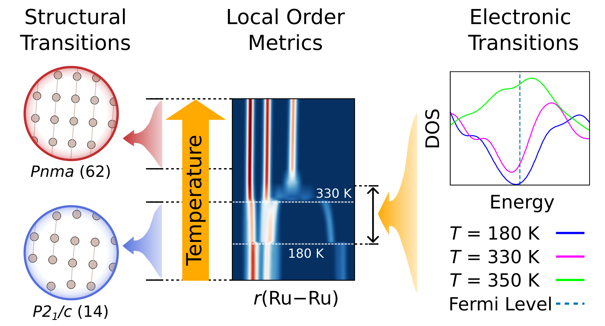

# Supporting Code for “*Local Symmetry Breaking and Two-Stage Phase Transitions in RuP Uncovered by a Fine-Tuned Atomistic Foundation Model*”

## Graphical Abstract



---

📄 Author: **Ouail Zakary**

---

👤 Corresponding Authors: **Ouail Zakary** and **Niraj Aryal**  
- 📧 Email: [Ouail.Zakary@oulu.fi](mailto:Ouail.Zakary@oulu.fi)  
- 🔗 ORCID: [0000-0002-7793-3306](https://orcid.org/0000-0002-7793-3306)  
- 🌐 Website: [Personal Webpage](https://cc.oulu.fi/~nmrwww/members/Ouail_Zakary.html)  
- 📁 Portfolio: [Academic Portfolio](https://ozakary.github.io/)

---

This is the supporting code for the manuscript “***Local Symmetry Breaking and Two-Stage Phase Transitions in RuP Uncovered by a Fine-Tuned Atomistic Foundation Model***”. [DOI: TBA]

The repository comprises the following sections:

1. `VASP` input files for AIMD simulations. ([directory](./vasp-aimd_inputs/))  
2. Dataset preparation procedure and `.config` file for fine-tuning `MACE-MP-0b3` foundation model. ([directory](./mace-mp-0b3_fine-tuning/))  
3. `LAMMPS` input files for machine learning MD simulations. ([directory](./lammps-mlmd_simulations/))  
4. Python script for processing the output MLMD trajectories and creating the average structures. ([directory](./lammps-mlmd_postprocessing/))  
5. Python scripts used to compute RDFs and structure factors. ([directory](./rdfs_and_structure-factors/))  
6. Python scripts used to compute local-order metrics. ([directory](./local-order_metrics/))  
7. Python scripts used for the machine learning-accelerated phonon dispersion analysis. ([directory](./ml-phonons/))  
8. Python scripts and raw numerical data for all figures used in the main manuscript and the Supporting Information. ([directory](./figures/))  

## Citations
If you use this data, please cite the following:

### Preprint [](https://doi.org/10.26434/chemrxiv.15001387/v1)

```bibtex
@article{zakary_2025_rup_ml,
  title={Local Symmetry Breaking and Two-Stage Phase Transitions in RuP Uncovered by a Fine-Tuned Atomistic Foundation Model},
  author = {Zakary, Ouail, and Yin, Weiguo and Aryal, Niraj},
  journal={ChemRxiv},
  year={2026},
  doi={10.26434/chemrxiv.15001387/v1},
  url={https://doi.org/10.26434/chemrxiv.15001387/v1},
  note={Preprint}
}
```

### Dataset [](https://doi.org/10.5281/zenodo.18709769)

```bibtex
@dataset{zakary_2025_data_rup_ml,
  author = {Zakary, Ouail, and Yin, Weiguo and Aryal, Niraj},
  title = {Supporting Data for "Local Symmetry Breaking and Two-Stage Phase Transitions in RuP Uncovered by a Fine-Tuned Atomistic Foundation Model"},
  year = {2026},
  publisher = {Zenodo},
  doi = {10.5281/zenodo.18709769},
  url = {https://doi.org/10.5281/zenodo.18709769}
}
```

### Code [](https://github.com/ozakary/data-RuP)
```bibtex
@misc{zakary_2025_github_rup_ml,
  author = {Zakary, Ouail, and Yin, Weiguo and Aryal, Niraj},
  title = {Supporting Code for "Local Symmetry Breaking and Two-Stage Phase Transitions in RuP Uncovered by a Fine-Tuned Atomistic Foundation Model"},
  year = {2026},
  publisher = {GitHub},
  journal = {GitHub repository},
  howpublished = {\url{https://github.com/ozakary/data-RuP}},
  url = {https://github.com/ozakary/data-RuP}
}
```

---
For further details, please refer to the respective folders or contact the author via the provided email.
